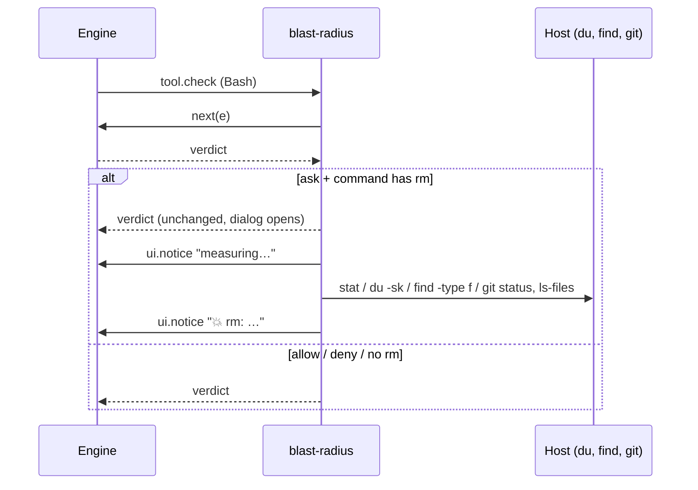

# blast-radius

A Claude Code mod. When a Bash command is about to ask for permission, it previews the blast radius:

- **Built in:** any `rm` is measured (files, size, what git can't restore).
- **Your rules:** a regex per command, and a dry-run to run when it matches (`kubectl delete` → `--dry-run=server`).

One line goes under the dialog. Details (per path, full dry-run output) go to the **Blast radius** side pane, which `/blast-radius` also opens. Nothing reaches the model's context.

The line under the dialog for an `rm`:

```
💥 rm -r: ⚠ 1,117 not in git (1,100 gitignored) · 1,204 files · 48 MB
💥 rm -r: ⛔ deletes $HOME · ⚠ 312,004 not in git · ≥240,118 files · ≥12 GB
💥 rm: all in git · 2 files · 4 KB
```

Read it worst news first:

| Part | Meaning |
| --- | --- |
| `⛔ deletes /`, `$HOME`, `the project`, `.git history` | the target is (or contains) one of these |
| `⚠ N not in git` | modified, untracked or gitignored files, or files outside any repo: **gone for good** |
| `(M gitignored)` | the part of N that is gitignored: build output, but also `.env` files |
| `all in git` | everything is committed or staged: `git checkout` brings it back |
| `outside project` | a target outside the session's working directory |
| `≥` | a probe hit its 3 s limit; the real number is bigger |

## Rules: your own dry-runs

Add them to any `settings.json` (user, project or local) under `pluginConfigs.blast-radius.options`. Keys are flat, one per field, like env-badge:

```json
{
  "pluginConfigs": {
    "blast-radius": {
      "options": {
        "rules": ["kdel", "tfd", "rmls"],
        "kdel.match": "^kubectl delete (.+)$",
        "kdel.preview": "kubectl delete $1 --dry-run=server -o name",
        "tfd.match": "^terraform destroy",
        "tfd.preview": "terraform plan -destroy -no-color",
        "rmls.match": "^rm -rf (.+)$",
        "rmls.preview": "ls -la $1"
      }
    }
  }
}
```

- `match` is a JavaScript regex, tested against **each command of a chain or pipe on its own**: in `cd app && kubectl delete pod a | tee log` it sees `cd app`, `kubectl delete pod a` and `tee log`. `VAR=x` and `sudo` prefixes are dropped first.
- `preview` fills `$0`-`$9` from the match, then splits into words the way the shell would (quotes kept). It runs in the directory a `cd` earlier in the chain left, 10 s at most.
- Settings are read on every prompt: edits apply without a reload.

More ready-made rules, each covered by a test, in [`examples/rules.json`](examples/rules.json). Copy the ones you want:

| Command | Preview |
| --- | --- |
| `rm -rf a b` | `ls -la a b` |
| `kubectl delete …` | `kubectl delete … --dry-run=server -o name` |
| `kubectl apply …` | `kubectl diff …` |
| `kubectl drain NODE` | pods on `NODE` |
| `helm uninstall REL …` | `helm get manifest REL …` |
| `terraform destroy` / `apply` | `terraform plan [-destroy]` |
| `git clean …` | `git clean -n …` |
| `git reset --hard` | `git diff --stat HEAD` |
| `git push -f` | upstream commits the push drops (`HEAD..@{u}`, as of the last fetch) |
| `git branch -D B` | commits of `B` on no remote |
| `git stash drop` / `clear` | `git stash list` |
| `find … -delete` | `find … -print` |
| `rsync … --delete …` | `rsync --dry-run --itemize-changes …` |
| `aws s3 rm` / `mv` / `sync` | same with `--dryrun` |
| `docker … prune` | `docker system df` |

> ⚠ **A preview runs without asking**, every time its rule matches a prompt. Make it read-only. The mod refuses a preview when, after filling in, it would chain commands (`;` `|` `&`), still holds `$VAR` or `$(..)` (so a captured `$(curl ..)` never runs), or starts with a shell or wrapper (`sh`, `bash`, `env`, `sudo`, `xargs`, `python`, ...). It runs by argv, never through a shell. It cannot know whether your program writes.

## Display only, never a gate

The mod passes the permission decision through untouched. It never allows, denies or rewrites a call.

**No line does not mean safe.** The parser reads the command like a human skimming it. It misses `find -delete`, `bash -c`, aliases, functions, heredocs and scripts. `$VAR`, `$(..)` and `xargs rm` targets are reported as `unresolved` and never expanded, because expanding them would run them.

The pane opens at session start and on each preview, but is drawn by itself only on a wide terminal (144+ columns, 110 once you have opened it with `/blast-radius`). Narrower, the line ends in `details: /blast-radius`: run it to see the pane.

## How it works



- Only commands that will **ask** are measured: rules that already allow or deny cost nothing.
- Follows `cd X && rm Y`, quotes, escapes, `sudo`, redirects, one-level globs.
- Probes run by argv, never through a shell.

## Install

Needs function hooks (`CLAUDE_CODE_ENABLE_FUNCTION_HOOKS=1` where not on by default).

```bash
claude plugin marketplace add aqaurius6666/claude-blast-radius
```

```bash
claude plugin install blast-radius@blast-radius
```

For one session from a checkout:

```bash
claude --plugin-dir /path/to/claude-blast-radius
```

## Develop

```bash
bun test
```

```bash
claude plugin test .   # tests/*.test.ts, against the engine
```

```bash
bun x tsc -p .
```

```bash
claude plugin validate .
```

Types come from `/plugin-types` into `.claude/types/` (git-ignored, regenerate per Claude Code version).

Layout: `hooks/parse.ts` (command → chain/pipe segments, rm targets), `hooks/probe.ts` (targets → impact, host injected), `hooks/rules.ts` (settings → rules → preview argv), `hooks/format.ts` (impact → line), `hooks/register.tsx` (the hook and the pane), `types/index.d.ts` (pane state).
