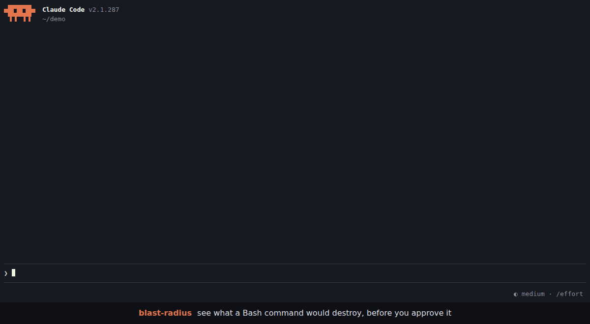
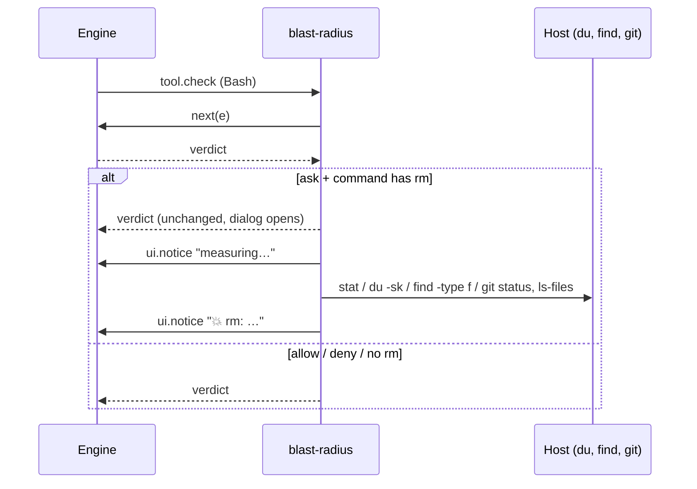

# blast-radius

A Claude Code mod. When a Bash command is about to ask for permission, it shows what the command would destroy, before you answer.



- **Built in:** every `rm` is measured: files, size, and how much git can't bring back.
- **Your rules:** a regex per command and a read-only dry-run to run when it matches (`git clean -fdx` → `git clean -n -fdx`).

One line goes under the dialog. Details (per path, full dry-run output) go to the **Blast radius** side pane, which opens with the prompt and closes once you answer it. Nothing reaches the model's context, and the permission decision is never changed.

## Quick start

**1. Turn on function hooks.** The mod is built on them. Add this to your shell rc (`~/.zshrc`, `~/.bashrc`) and open a new terminal:

```bash
export CLAUDE_CODE_ENABLE_FUNCTION_HOOKS=1
# inside tmux, herdr or another multiplexer, also:
export CLAUDE_CODE_NO_FLICKER=1
```

Without `CLAUDE_CODE_NO_FLICKER=1`, a multiplexer gets the main-screen layout, where the permission dialog draws over the pane.

**2. Install.**

```bash
claude plugin marketplace add aqaurius6666/claude-blast-radius
claude plugin install blast-radius@blast-radius
```

**3. Start Claude Code** (or run `/reload-plugins` in a session already open), and check it loaded:

```
/blast-radius
```

The **Blast radius** pane opens on the right with `Nothing yet: opens when a permission prompt has an rm or matches a rule.` That's it: you are set up. From now on the pane opens and closes by itself; this one, opened by hand, stays until you close it.

**4. See it work.** In a throwaway directory, ask Claude to delete something:

```bash
mkdir -p /tmp/br-try/build && cd /tmp/br-try && touch build/a.js build/b.js && claude
```

```
> delete the build folder
```

When the permission dialog opens, a line appears under it:

```
💥 rm -r: ⚠ 2 not in git · 2 files · 4 KB
```

> **No line?** The mod only speaks when Claude Code **asks**. If an allow rule or auto mode approves `rm` without asking, there is no dialog to annotate. To always be asked for `rm`, add to `~/.claude/settings.json`:
>
> ```json
> { "permissions": { "ask": ["Bash(rm *)"] } }
> ```
>
> Still nothing? See [Troubleshooting](#troubleshooting).

## Reading the line

```
💥 rm -r: ⚠ 1,117 not in git (1,100 gitignored) · 1,204 files · 48 MB
💥 rm -r: ⛔ deletes $HOME · ⚠ 312,004 not in git · ≥240,118 files · ≥12 GB
💥 rm: all in git · 2 files · 4 KB
```

Worst news first:

| Part | Meaning |
| --- | --- |
| `⛔ deletes /`, `$HOME`, `the project`, `.git history` | the target is (or contains) one of these |
| `⚠ N not in git` | modified, untracked or gitignored files, or files outside any repo: **gone for good** |
| `(M gitignored)` | the part of N that is gitignored: build output, but also `.env` files |
| `all in git` | everything is committed or staged: `git checkout` brings it back |
| `outside project` | a target outside the session's working directory |
| `≥` | a probe hit its 3 s limit; the real number is bigger |
| `🔍 N dry-runs` | your rules matched; their output is in the pane |
| `details: /blast-radius` | the pane could not be drawn (narrow terminal): run it to see details |

## The pane

- Opens by itself only while it has something to show: when a permission prompt has an `rm` or matches a rule, on a terminal **144+ columns** wide (110 once you have opened it yourself with `/blast-radius`). Narrower, the line ends in `details: /blast-radius`.
- Closes by itself once that prompt is answered (after the command runs, or when you say no).
- `/blast-radius` opens it and shows the last previewed command. Opened this way, it stays until you close it.
- `/blast-radius off` closes it and stops it opening by itself (kept across sessions). The line under the dialog stays. `/blast-radius on` undoes it.

## Add your own dry-runs

Rules live in any `settings.json` (user `~/.claude/settings.json`, project `.claude/settings.json` or local `.claude/settings.local.json`) under `pluginConfigs.blast-radius.options`. List rule names in `rules`, then give each a `.match` and a `.preview`:

```json
{
  "pluginConfigs": {
    "blast-radius": {
      "options": {
        "rules": ["kdel", "tfd", "gclean"],
        "kdel.match": "^kubectl delete (.+)$",
        "kdel.preview": "kubectl delete $1 --dry-run=server -o name",
        "tfd.match": "^terraform destroy",
        "tfd.preview": "terraform plan -destroy -no-color",
        "gclean.match": "^git clean (.+)$",
        "gclean.preview": "git clean -n $1"
      }
    }
  }
}
```

Settings are read on every prompt: edits apply without a reload. A broken rule shows as `⚠ config: …` at the top of the pane.

- `match` is a JavaScript regex, tested against **each command of a chain or pipe on its own**: in `cd app && kubectl delete pod a | tee log` it sees `cd app`, `kubectl delete pod a` and `tee log`. `VAR=x` and `sudo` prefixes are dropped first.
- `preview` fills `$0`-`$9` from the match, then splits into words the way the shell would (quotes kept). It runs in the directory a `cd` earlier in the chain left, 10 s at most.

Ready-made rules, each covered by a test, are in [`examples/rules.json`](examples/rules.json). Copy the ones you want:

| Command | Preview |
| --- | --- |
| `rm -rf a b` | `ls -la a b` |
| `kubectl delete …` | `kubectl delete … --dry-run=server -o name` |
| `kubectl apply …` | `kubectl diff …` |
| `kubectl drain NODE` | pods on `NODE` |
| `helm uninstall REL …` | `helm get manifest REL …` |
| `terraform destroy` / `apply` | `terraform plan [-destroy]` |
| `git clean …` | `git clean -n …` |
| `git reset --hard` | `git diff --stat HEAD` |
| `git push -f` | upstream commits the push drops (`HEAD..@{u}`, as of the last fetch) |
| `git branch -D B` | commits of `B` on no remote |
| `git stash drop` / `clear` | `git stash list` |
| `find … -delete` | `find … -print` |
| `rsync … --delete …` | `rsync --dry-run --itemize-changes …` |
| `aws s3 rm` / `mv` / `sync` | same with `--dryrun` |
| `docker … prune` | `docker system df` |

> ⚠ **A preview runs without asking**, every time its rule matches a prompt. Make it read-only. The mod refuses a preview when, after filling in, it would chain commands (`;` `|` `&`), still holds `$VAR` or `$(..)` (so a captured `$(curl ..)` never runs), or starts with a shell or wrapper (`sh`, `bash`, `env`, `sudo`, `xargs`, `python`, ...). It runs by argv, never through a shell. It cannot know whether your program writes.

## Display only, never a gate

The mod passes the permission decision through untouched. It never allows, denies or rewrites a call.

**No line does not mean safe.** The parser reads the command like a human skimming it. It misses `find -delete`, `bash -c`, aliases, functions, heredocs and scripts. `$VAR`, `$(..)` and `xargs rm` targets are reported as `unresolved` and never expanded, because expanding them would run them.

## Troubleshooting

| Symptom | Fix |
| --- | --- |
| `/blast-radius` is an unknown command | Function hooks are off: `echo $CLAUDE_CODE_ENABLE_FUNCTION_HOOKS` must print `1` in the shell that starts `claude`. Then check `claude plugin list` shows `blast-radius@blast-radius` as enabled. Restart Claude Code after either fix. |
| No line under the dialog | The command did not ask (allowed by a rule or auto mode): add `Bash(rm *)` to `permissions.ask`, see [step 4](#quick-start). For your own rules, check the regex against the single command, not the whole chain. |
| Line ends in `details: /blast-radius` | The terminal is under 144 columns: widen it or run `/blast-radius`. |
| Dialog drawn over the pane | You are in a multiplexer: `export CLAUDE_CODE_NO_FLICKER=1` and restart. |
| Pane never opens by itself | You ran `/blast-radius off` once: run `/blast-radius on`. |
| `⚠ config: …` in the pane | A rule is missing `.match` / `.preview` or its regex does not compile. |

Update or remove:

```bash
claude plugin update blast-radius@blast-radius     # restart to apply
claude plugin uninstall blast-radius@blast-radius
```

## How it works



- Only commands that will **ask** are measured: rules that already allow or deny cost nothing.
- Follows `cd X && rm Y`, quotes, escapes, `sudo`, redirects, one-level globs.
- Probes run by argv, never through a shell.

## Develop

Run from a checkout for one session:

```bash
CLAUDE_CODE_ENABLE_FUNCTION_HOOKS=1 claude --plugin-dir /path/to/claude-blast-radius
```

Checks:

```bash
bun test                      # tests/*.spec.ts: parser, probes, rules
claude plugin test .          # tests/*.test.ts, against the engine
bun x tsc -p .                # types
claude plugin validate .      # manifests
```

Types come from `/plugin-types` into `.claude/types/` (git-ignored, regenerate per Claude Code version).

Layout: `hooks/parse.ts` (command → chain/pipe segments, rm targets), `hooks/probe.ts` (targets → impact, host injected), `hooks/rules.ts` (settings → rules → preview argv), `hooks/format.ts` (impact → line), `hooks/register.tsx` (the hook and the pane), `types/index.d.ts` (pane state).
